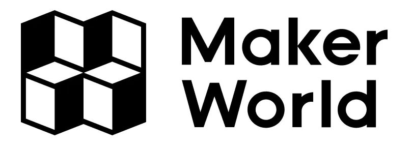
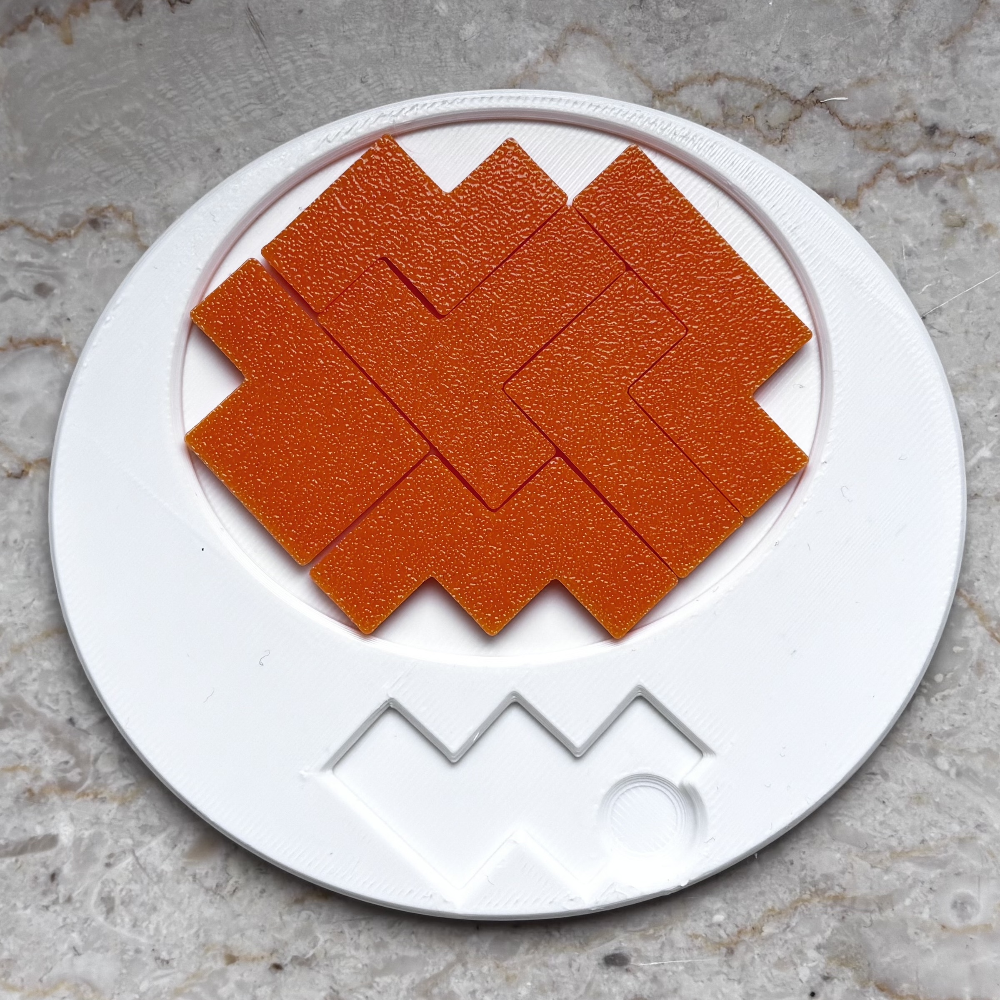

# Cracked Egg - 🟨 (Level 8)

## 📄 Description

Crack your intuition with this masterwork of spatial misdirection. Six interlocking pieces that must nest together in an egg shape. The curves suggest softness, but the geometry inside is anything but. 

Rotate, test, retreat, and rethink—only a precise sequence will bring the shell together in a single form.

👉 **[Download Model](https://makerworld.com/en/models/2103119-cracked-egg-puzzle-level-8-10)**  

---

## 🔑 Solution

  
 ⚠️ Click here to reveal the solution ⚠️

 

