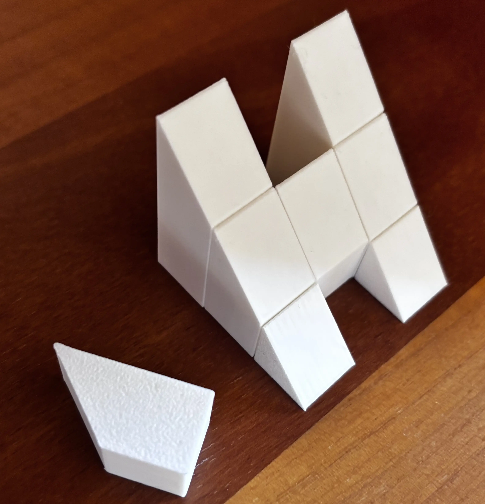

# H Puzzle - 🟥 (Level 10)

## 📄 Description

Unleash your spatial wit with this 10/10 brain teaser 3D puzzle. Eight solid pieces: two tall, two short and four medium; each meticulously cut at 45°. Your mission: craft a perfect letter “H”. At first glance it seems impossible, but with patience and a shift in perspective, the hidden geometry will reveal itself.

Experiment, rotate, and think in three dimensions to discover the solution!

👉 **[Download Makerworld Model](https://makerworld.com/en/@darionji)**

---

## 🔑 Solution

  
 ⚠️ Click here to reveal the solution ⚠️

* Pieces must be arranged so that their beveled cross‑sections face forward. Looking down from above or laying pieces flat will not solve it — this is a true 3‑D construction puzzle.
* One piece remains unused, a subtle decoy for the observant solver

---

[🔙 Main Puzzle Catalog](../Puzzle_Catalog.md)
